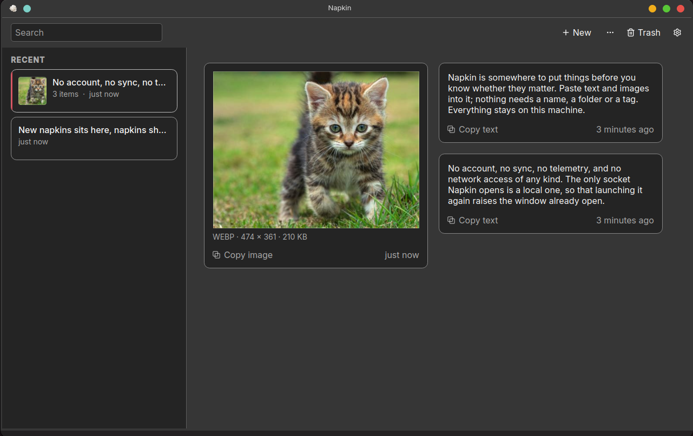
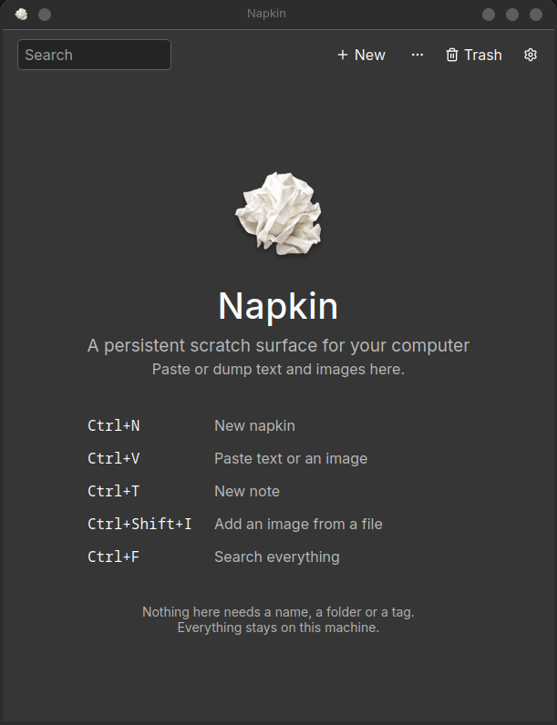
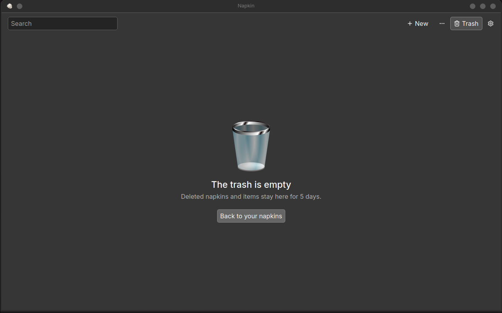

<p align="center">
  
</p>

<h1 align="center">Napkin</h1>

<p align="center">A persistent scratch surface for your computer.</p>

Napkin is somewhere to put things before you know whether they matter. Paste
text and images into it; nothing needs a name, a folder or a tag. Everything
stays on this machine.

The icon is a crumpled napkin, which is the whole idea: you write on one without
deciding first whether it is worth writing on.

> **Status: early development (0.1.6), Linux and Windows.** Expect rough edges.
> Windows is newer and less used than Linux; macOS is planned, not started.



## What it's for

The gap this fills is between the clipboard, which forgets, and a notes app,
which asks you to file things.

- **The paste you will want in ten minutes.** A token, a container id, an `ssh`
  command, the error you are about to search for. It does not deserve a file and
  it should not have to fight for the clipboard.
- **A debugging session's screenshots.** Grab, paste, keep grabbing. They sit
  next to the log lines and the stack trace instead of piling up in `~/Pictures`
  under names like `Screenshot_20260923_070305.png`.
- **Links to deal with later.** A URL on its own becomes a chip you can open,
  and it stays searchable by its address.
- **A scratchpad per task.** One napkin for the ticket you are on, another for
  the one you were interrupted by. Neither needs a title, and neither has to be
  filed when you are done.
- **The things you are not ready to name.** A draft paragraph, a half-formed
  idea, a quote. Napkin exists to *postpone* the decision to organise, which is
  the decision that usually stops people capturing anything at all.

It is deliberately **not** Evernote, Notion, Obsidian or OneNote, not a task
manager, and not a clipboard-history tool — your OS already has one of those.
There is no AI in it: it never summarises, categorises, names or tags anything.
See [SPEC.md](SPEC.md) §1.

## What it does

- **Napkins, not documents.** `Ctrl+N` gives you a fresh napkin. Paste onto it,
  type on it, and move on. Nothing asks for a title.
- **A board, not a page.** Items are cards, laid out in columns that widen with
  the window rather than multiplying, so a three-word note stays a three-word
  note. Click to select, `Ctrl`/`Shift`+click or `Ctrl+A` for more than one,
  arrow keys to walk the board, `Ctrl+C`/`Ctrl+X`/`Delete` to act on what is
  selected.
- **Text and images, and nothing else.** Text, where a link on its own shows as
  a chip you can open and a link inside prose opens with `Ctrl`+click; and
  images: PNG, JPEG, WebP, SVG and animated GIF. Double-click an image to open
  it full size.
- **Search everything** with `Ctrl+F`: text, links and image filenames. Matches
  are highlighted where they sit, and *All napkins* puts the rest back.
- **Nothing is deleted on your behalf.** Napkins you have not touched in 30 days
  move to an *Older* section. *Clean up* moves them to the trash only when you
  ask, and it can be undone. *Pin* keeps a napkin at the top; *Keep* means Clean
  up never touches it.
- **Deleting is always recoverable.** A deleted napkin, or items deleted from
  one, wait in the trash for 30 days. Both thresholds are yours to change in
  *File → Settings…*.
- **It looks like your desktop.** Theme follows the system — and keeps following
  it while running, not only at startup — or you can pin Light or Dark. Accent
  colour, typeface and text size are settings too.
- **Out of the way, not gone.** Optionally keep Napkin in the system tray, so
  closing the window hides it instead of quitting. Its menu makes a new napkin,
  or pastes the clipboard onto a new one, in a click.
- **Export** one napkin or everything to a folder of ordinary files at any
  time (*File → Export this napkin…* / *Export everything…*).

## Screens

<table>
<tr>
<td width="50%" valign="top">



**First run.** No account, no setup, no import step — just the five keys that
matter.

</td>
<td width="50%" valign="top">



**The trash.** Deleted napkins and items wait here rather than going. The
retention shown is this install's setting, not the 30-day default.

</td>
</tr>
</table>

## Privacy

- No account, no sync, no telemetry, and no network access of any kind. The
  only socket Napkin opens is a local one, so that launching it again raises
  the window already open.
- Your data lives in `~/.local/share/napkin/napkin/`: a SQLite database plus
  image files. The directory is readable only by you (`0700`, database `0600`),
  and it is marked so that desktop search (Baloo, Tracker) does not index it.
- **Keep is retention, not encryption. There is no at-rest encryption.** Anyone
  who can read your home directory can read what you pasted. A scratch surface
  will end up holding tokens and passwords, so treat it like one.

## Install

Releases publish an AppImage and a Windows zip on the
[releases page](https://github.com/sudomonas/napkin/releases).

**Linux:**

```sh
chmod +x napkin-v*-x86_64.AppImage
./napkin-v*-x86_64.AppImage
```

**Windows 10 and 11 (64-bit):** unzip `napkin-v*-windows-x64.zip` anywhere and
run `napkin.exe`; nothing needs installing. The build is not code-signed, so
SmartScreen will warn the first time — *More info → Run anyway*. Your napkins
are kept in `%LOCALAPPDATA%\napkin\napkin`, readable only by you, so deleting
the unzipped folder does not delete them.

On **Arch Linux**, build a pacman package from the latest `master`:

```sh
git clone https://github.com/sudomonas/napkin.git
cd napkin/packaging/arch
makepkg -si                      # builds, runs the tests, installs under /usr
```

Remove it with `sudo pacman -R napkin-git`.

A Flatpak manifest is in `packaging/`; it has not been submitted to Flathub yet.

## Build from source

Requirements:

- A C++20 compiler. CI builds with GCC 11 (Ubuntu 22.04) and GCC 13 (Ubuntu 24.04).
- CMake 3.24 or newer, and Ninja (recommended)
- Qt 6.5 or newer: Core, Gui, Widgets, Network and Test, plus the
  `qtimageformats` and `qtsvg` plugins at runtime for WebP and SVG
- SQLite 3 with FTS5, 3.31 or newer. CI tests 3.31.1 and 3.37.2 as well as the
  runner's own.

On Arch Linux:

```sh
sudo pacman -S --needed base-devel cmake ninja qt6-base qt6-imageformats qt6-svg sqlite
```

On Debian and Ubuntu, check that your release's Qt is 6.5 or newer; Ubuntu
24.04 ships 6.4, which is too old.

Then:

```sh
cmake -S . -B build -G Ninja -DCMAKE_BUILD_TYPE=Release
cmake --build build
ctest --test-dir build --output-on-failure
sudo cmake --install build        # or --prefix ~/.local
```

The test suites need no display: the GUI tests run on Qt's offscreen platform.

## Keyboard

| Key | Action |
|---|---|
| `Ctrl+N` | New napkin |
| `Ctrl+V` | Paste onto this napkin |
| `Ctrl+T` | New note on this napkin |
| `Ctrl+Shift+I` | Add an image from a file |
| `Ctrl+F` / `Ctrl+K` | Search |
| `Ctrl+Shift+V` | Paste into the search box (plain `Ctrl+V` there pastes onto the napkin) |
| `Ctrl+Home` | Clear the search and show all napkins |
| `Ctrl+P` / `Ctrl+D` | Pin or keep the selected napkin |
| `Ctrl+Z` | Undo the last delete, pin or keep |
| `Delete` | Move the selected napkin to the trash (list focused) |

On the napkin itself: arrow keys move between cards, `Ctrl+A` selects every
item, `Ctrl+C` / `Ctrl+X` / `Delete` act on the selection, and `Ctrl+Enter` or
`Esc` finishes editing. The full list is under *Help → Keyboard shortcuts…*.
Typing on an empty napkin, or double-clicking empty space on one, also starts a
note, and right-clicking an item offers Edit, Copy, Cut and Delete.

## Known limitations

- There is no global "capture" hotkey yet. It needs the XDG GlobalShortcuts
  portal and is planned.
- A single napkin holding around a thousand items is slow to open. Typical use
  (hundreds of napkins, each with up to about a hundred items) meets every
  performance target in [SPEC.md](SPEC.md) §12.
- macOS is not started. Windows works and passes the full suite in CI, but has
  had far less real use than Linux.

## Design

[SPEC.md](SPEC.md) is the design document and the project's record of
decisions, measurements and corrected mistakes. Read it before proposing a
feature; §21 is the test every feature has to pass.

## License

[MIT](LICENSE). The toolbar icons are from [Lucide](https://lucide.dev), under
the ISC and MIT licences in
[`resources/icons/lucide/LICENSE`](resources/icons/lucide/LICENSE).
